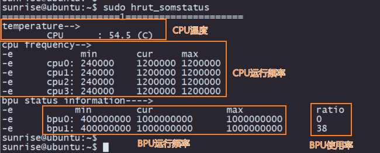

# 2.3 CPU调频策略

<iframe src="//player.bilibili.com/player.html?aid=700903305&bvid=BV1rm4y1E73q&cid=1196557803&page=14" scrolling="no" border="0" frameborder="no" framespacing="0" width="960" height="540" allowfullscreen="true"> </iframe>

开发板采用CPU Freq驱动对CPU工作状态进行管理，默认模式为`ondemand`模式，此时CPU工作频率会根据负载进行动态调节，以节省功耗。用户可修改到`performance`模式，使CPU始终运行在最高频率下，命令如下：
```bash
sudo bash -c 'echo performance > /sys/devices/system/cpu/cpufreq/policy0/scaling_governor'
```

开发板在系统中提供了超频功能，可将CPU最高频率从1.2GHz提升到1.5GHz，配置命令如下：
```bash
sudo bash -c 'echo 1 > /sys/devices/system/cpu/cpufreq/boost'
```

使用以上命令配置的 CPU 频率仅在当前运行中生效，如果设备重启则恢复默认配置。

**注意**
CPU超频会增加芯片的功耗和发热，如出现稳定性问题，可通过如下命令关闭超频功能：
```bash
sudo bash -c 'echo 0 > /sys/devices/system/cpu/cpufreq/boost'
```

如需查看芯片工作频率、温度等状态，可通过`sudo hrut_somstatus`命令查询：  
