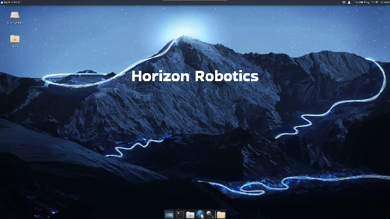
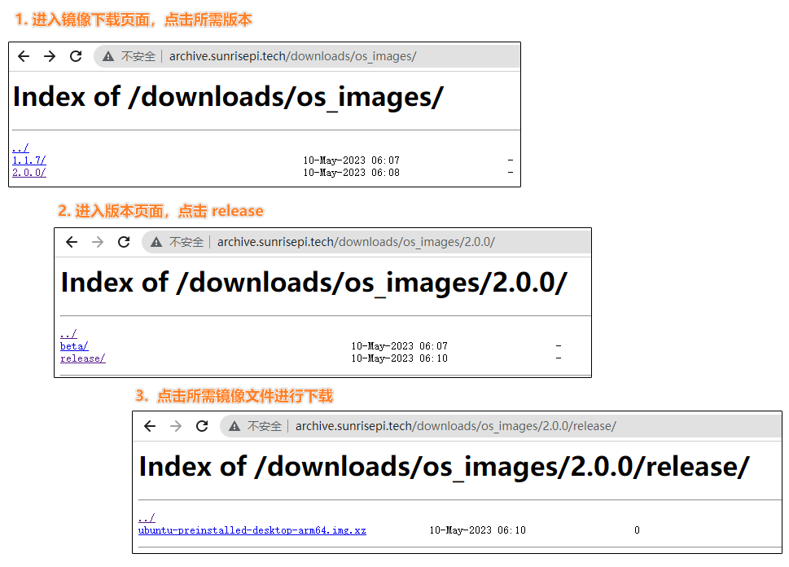
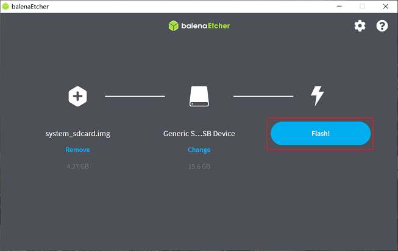
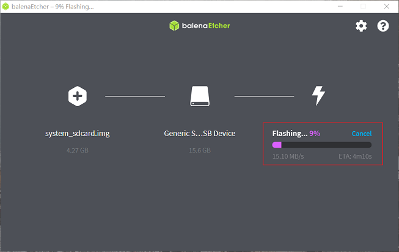
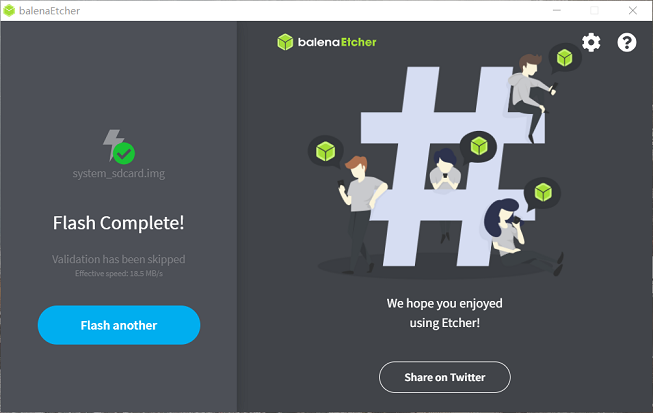

# 2.2 安装系统

开发板支持Ubuntu 20.04 Desktop系统版本，支持图形化交互。

Ubuntu Desktop版本系统启动完成后，会通过HDMI接口在显示器上输出系统桌面，如下图：

## 镜像下载 {#img_download}

下载Ubuntu镜像压缩包，解压出Ubuntu系统镜像文件：`ubuntu-preinstalled-desktop-arm64.img`，1.0版本的系统镜像名为`system_sdcard.img`。

**版本说明：**
- 2.0版本：基于RDK Linux开源代码包制作，支持RDK X3派、X3模组等全系列硬件
- 1.0版本：旭日X3派历史版本，仅支持旭日X3派硬件

点击 [**下载镜像**](http://archive.sunrisepi.tech/downloads/os_images) 进入版本选择页面，选择对应版本目录，进入文件下载页。以下载2.0.0版本的系统镜像为例：

## 烧录系统到Micro SD卡

在烧录Ubuntu系统镜像前，用户需要做如下准备：

- 准备至少8GB容量的Micro SD卡
- SD 读卡器
- 下载镜像烧录工具balenaEtcher，下载链接：[https://www.balena.io/etcher/](https://www.balena.io/etcher/)

balenaEtcher是一款支持Windows/Mac/Linux等多平台的PC端启动盘制作工具，制作SD启动卡流程如下：
1. 打开balenaEtcher工具，点击`Flash frome file`按钮，选择解压出来的`ubuntu-preinstalled-desktop-arm64.img`文件作为烧录镜像 

    

2. 点击`Select target`按钮，选择对应的Micro SD存储卡作为目标存储设备  

    

3. 点击`Flash`按钮开始烧录，待工具提示`Flash Complete`时，表示镜像烧录完成，您可以关闭balenaEtcher工具并取出存储卡

    

    

    

如Micro SD存储卡烧录过程发生中断，用户需要按照上述步骤重新进行。

## 烧录系统到eMMC

RDK X3模组支持eMMC存储方式，当烧录系统到eMMC时，需要使用地平线hbupdate烧录工具，请按照以下步骤进行工具的下载和安装：
1. 下载hbupdate烧录工具，下载链接：[hbupdate](http://archive.sunrisepi.tech/downloads/hbupdate/)。
2. 工具分为Windows、Linux两种版本，分别命名为 `hbupdate_win64_vx.x.x_rdk.tar.gz`、 `hbupdate_linux_gui_vx.x.x_rdk.tar.gz。
3. 解压烧录工具，解压目录需要不包含**空格、中文、特殊字符**。

### 安装USB驱动

在使用刷机工具前，需要在PC上安装USB驱动程序，点击 [android_hobot](http://archive.sunrisepi.tech/downloads/hbupdate/android_hobot.zip) 下载驱动程序。

**按照以下步骤安装驱动：**  
1）解压 `android_hobot.zip` ，进入解压后的目录，以管理员身份运行 `5-runasadmin_register-CA-cer.cmd` 完成驱动程序的注册。

2）设置开发板的`Boot`Pin为`ON`模式，将开发板与PC通过USB线连接，然后给开发板上电。

3）如PC设备管理器出现`USB download gadget`未知设备时，需要更新设备驱动，选择解压出的驱动文件夹`andriod_hobot`，然后点击下一步，完成驱动安装，如下图：

4）驱动安装完成后，设备管理器会显示fastboot设备`Android Device`，如下图：

### 烧录系统{#flash_system}

确认PC设备管理器显示fastboot设备`Android Device`后，运行`hbupdate.exe`打开烧录工具，并按照以下步骤进行烧录：

1）选择开发板型号，必选项。

- RDK_X3_2GB： RDK X3（旭日X3派），2GB内存版本，仅支持烧写最小系统镜像

- RDK_X3_4GB： RDK X3（旭日X3派），4GB内存版本，仅支持烧写最小系统镜像

- RDK_X3_MD_2GB： RDK X3 Module，2GB内存版本

- RDK_X3_MD_4GB： RDK X3 Module，4GB内存版本

2）点击`Browse`按钮选择将要烧录的镜像文件，必选项。

3）点击`Start`按钮开始刷机，根据弹窗提示开始烧录：

- 烧录镜像时，BOOT开关需要拨到`ON`位置，如下图所示：

  

- 通过 Type C 的USB接口连接到电脑，电脑设备管理器中会识别出一个`Android Device`的设备，如上一节安装USB下载驱动所描述

- 烧录完毕断开电源，断开和电脑的连接线，将BOOT开关拨至`OFF`，重新上电即可

- 如果启动正常，在硬件上的`ACT LED`灯会进入`两次快闪一次慢闪`的状态

4）检查升级结果
- 镜像烧录成功时，工具提示如下：

- 镜像烧录失败时，工具提示如下，此时需要确认PC设备管理器是否存在`Android Device`设备

## 启动系统

首先保持开发板断电，然后将制作好的存储卡插入开发板的Micro SD卡槽，并通过HDMI线缆连接开发板与显示器，最后给开发板上电。用户可通过指示灯判断开发板状态，指示灯说明如下：

* 红色指示灯：点亮代表硬件上电正常
* 绿色指示灯：点亮代表系统启动中，熄灭或闪烁代表系统启动完成

系统首次启动时会进行默认环境配置，整个过程持续45秒左右，配置结束后会在显示器输出Ubuntu系统桌面。

如果开发板上电后长时间没有显示输出（2分钟以上），说明开发板启动异常。此时用户可通过指示灯确认系统状态，方法如下：

* 绿灯常亮：说明系统启动失败，可检查使用的电源适配器是否满足**5V3A**的要求，可尝试重新制作Micro SD卡系统镜像
* 绿灯熄灭或闪烁：说明系统启动成功，但显示服务启动失败，请确认连接的显示器符合支持列表规格
