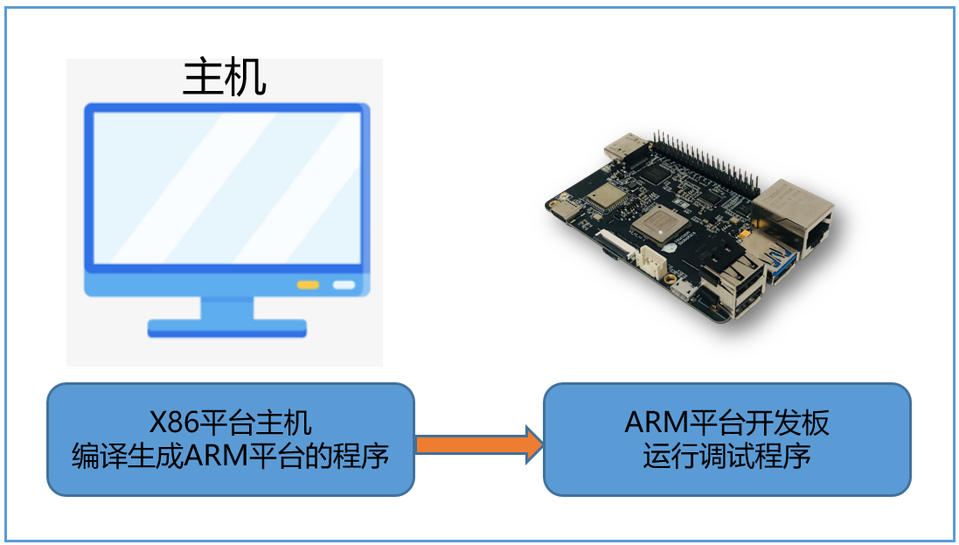
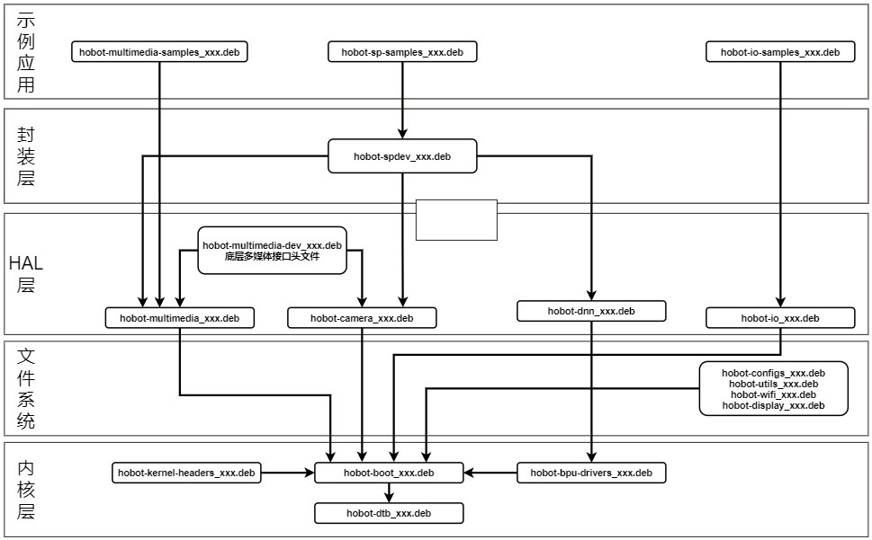

# 6.1 开发环境搭建及编译说明

本章节介绍交叉编译开发环境的要求及搭建，源码下载和系统镜像的编译方法说明。

## 交叉编译开发环境

交叉编译是指在主机上开发和构建软件，然后把构建的软件部署到开发板上运行。主机一般拥有比开发板更高的性能和内存，可以加速代码的构建，可以安装更多的开发工具，方便开发。



**主机编译环境要求**

推荐使用 Ubuntu 操作系统，若使用其它系统版本，可能需要对编译环境做相应调整。

Ubuntu 18.04 系统安装以下软件包：

```shell
sudo apt-get install -y build-essential make cmake libpcre3 libpcre3-dev bc bison \
flex python-numpy mtd-utils zlib1g-dev debootstrap \
libdata-hexdumper-perl libncurses5-dev zip qemu-user-static \
curl git liblz4-tool apt-cacher-ng libssl-dev checkpolicy autoconf \
android-tools-fsutils mtools parted dosfstools udev rsync
```

Ubuntu 20.04 系统安装以下软件包：

```shell
sudo apt-get install -y build-essential make cmake libpcre3 libpcre3-dev bc bison \
flex python-numpy mtd-utils zlib1g-dev debootstrap \
libdata-hexdumper-perl libncurses5-dev zip qemu-user-static \
curl git liblz4-tool apt-cacher-ng libssl-dev checkpolicy autoconf \
android-sdk-libsparse-utils android-sdk-ext4-utils mtools parted dosfstools udev rsync
```

Ubuntu 22.04 系统安装以下软件包：

```shell
sudo apt-get install -y build-essential make cmake libpcre3 libpcre3-dev bc bison \
flex python3-numpy mtd-utils zlib1g-dev debootstrap \
libdata-hexdumper-perl libncurses5-dev zip qemu-user-static \
curl repo git liblz4-tool apt-cacher-ng libssl-dev checkpolicy autoconf \
android-sdk-libsparse-utils mtools parted dosfstools udev rsync
```

** 安装python **

编译linux内核需要依赖python2环境，ubuntu22.04之后的版本默认不再安装python2，所以需要执行以下命令安装：

```shell
sudo apt install python2
```

编译debian包需要依赖python3环境，通过以下命令设置python选择器，并且安装 python3-setuptools和pip，它们是生成wheel包的依赖工具：


```shell
sudo update-alternatives --install /usr/bin/python python /usr/bin/python2 1
sudo update-alternatives --install /usr/bin/python python /usr/bin/python3 2
sudo update-alternatives --list python

apt-get install python3-setuptools
curl https://bootstrap.pypa.io/get-pip.py -o get-pip.py
python get-pip.py
```

**安装交叉编译工具链**

执行以下命令下载交叉编译工具链：

```shell
curl -fO http://archive.sunrisepi.tech/toolchain/gcc-ubuntu-9.3.0-2020.03-x86_64-aarch64-linux-gnu.tar.xz
```

解压并安装，建议安装到/opt目录下，通常向/opt目录写数据需要sudo权限，例如:

```shell
sudo tar -xvf gcc-ubuntu-9.3.0-2020.03-x86_64-aarch64-linux-gnu.tar.xz -C /opt
```

配置交叉编译工具链的环境变量：

```shell
export CROSS_COMPILE=/opt/gcc-ubuntu-9.3.0-2020.03-x86_64-aarch64-linux-gnu/bin/aarch64-linux-gnu-
export LD_LIBRARY_PATH=/opt/gcc-ubuntu-9.3.0-2020.03-x86_64-aarch64-linux-gnu/lib/x86_64-linux-gnu:$LD_LIBRARY_PATH
export PATH=$PATH:/opt/gcc-ubuntu-9.3.0-2020.03-x86_64-aarch64-linux-gnu/bin/
export ARCH=arm64
```

以上命令是临时配置环境变量，要想配置永久生效，可以把以上命令添加到环境变量文件 `~/.profile` 或者 `~/.bash_profile` 的末尾。

## 编译环境源码(rdk-gen)

rdk-gen用于构建适用于地平线RDK X3的定制操作系统镜像。它提供了一个可扩展的框架，允许用户根据自己的需求定制和构建RDK X3的Ubuntu操作系统。

下载源码：

```shell
git clone https://github.com/HorizonRDK/rdk-gen.git
```

下载完成后，rdk-gen的目录结构如下：

| **目录**                  | **说明**                                                     |
| ------------------------- | ------------------------------------------------------------ |
| pack_image.sh             | 构建系统镜像的代码入口                                       |
| download_samplefs.sh      | 下载预先制作的基础ubuntu文件系统                       |
| download_deb_pkgs.sh      | 下载地平线的deb软件包，需要预装到系统镜像中，包括内核、多媒体库、示例代码、tros.bot等 |
| hobot_customize_rootfs.sh | 定制化修改ubuntu文件系统                               |
| source_sync.sh            | 下载源码，包括bootloader、uboot、kernel、示例代码等源码      |
| mk_kernel.sh              | 编译内核、设备树和驱动模块                                   |
| mk_debs.sh                | 生成deb软件包                                                |
| make_ubuntu_samplefs.sh   | 制作ubuntu系统filesystem的代码，可以修改本脚本定制samplefs   |
| config                    | 存放需要放到系统镜像/hobot/config目录下的内容，一个vfat根式的分区，如果是sd卡启动方式，用户可以在windows系统下直接修改该分区的内容。 |

## 编译系统镜像

运行以下命令进行系统镜像的打包：

```shell
cd rdk-gen
sudo ./pack_image.sh
```

需要有sudo权限进行编译，成功后会在deploy目录下生成 `*.img` 的系统镜像文件。

### pack_image.sh 编译过程介绍

1. 调用 download_samplefs.sh 和 download_deb_pkgs.sh 两个脚本从地平线的文件服务器上下载samplefs和需要预装的deb软件包
2. 解压samplefs，并调用 hobot_customize_rootfs.sh 脚本对filesystem做定制化配置
3. 把deb安装进filesystem
4. 生成系统镜像，参考 [安装系统](../installation/install_os) 使用系统镜像

## 下载源代码

只运行`pack_image.sh`编译系统镜像是不需要下载源代码的，因为`pack_image.sh`会从地平线的文件服务器上下载官方的debian软件包直接安装进系统，只有当您需要修改debian软件包的内容，重新制作自定义软件包的时候才需要下载源代码。

rdk-linux相关的linux内核、bootloader、hobot-xxx软件包源码都托管在 [GitHub](https://github.com/)上。在下载代码前，请先注册、登录  [GitHub](https://github.com/)，并通过 [Generating a new SSH key and adding it to the ssh-agent](https://docs.github.com/en/authentication/connecting-to-github-with-ssh/generating-a-new-ssh-key-and-adding-it-to-the-ssh-agent) 方式添加开发服务器的`SSH Key`到用户设置中。


`source_sync.sh`用于下载源代码，包括bootloader、uboot、kernel、示例代码等，该下载程序通过执行 `git clone git@github.com:xxx.git` 的方式把所有源码下载到本地。

执行以下命令下载主线分支代码（官方维护的最新release版本分支）：

```shell
./source_sync.sh -t main
```

执行以下命令下载开发分支代码（开发分支，测试不充分，可能会存在问题）：

```shell
./source_sync.sh -t develop
```

如果想要下载官方系统镜像版本完全对应的源码，如下载2.0.0版本镜像的源码，请用以下命令：

```shell
./source_sync.sh -t os-image_2.0.0
```

该程序默认会把源码下载到 source 目录下：

```
source
├── bootloader
├── hobot-boot
├── hobot-bpu-drivers
├── hobot-camera
├── hobot-configs
├── hobot-display
├── hobot-dnn
├── hobot-dtb
├── hobot-io
├── hobot-io-samples
├── hobot-kernel-headers
├── hobot-multimedia
├── hobot-multimedia-dev
├── hobot-spdev
├── hobot-sp-samples
├── hobot-utils
├── hobot-wifi
└── kernel
```

## 编译kernel

内核源码在 `source/kernel`，为方便内核的编译，提供`mk_kernel.sh`程序给用户使用。

执行以下命令编译linux内核：

```shell
./mk_kernel.sh
```

编译完成后，会在`deploy/kernel`目录下生成内核镜像、驱动模块、设备树、内核头文件。

```shell
dtb  Image  Image.lz4  kernel_headers  modules
```

这些内容会被hobot-boot、hobot-dtb和hobot-kernel-headers三个debian包所使用，所以如果想要自定义修改这三个软件包，需要先编译内核。

## 编译hobot-xxx软件包

hobot-xxx软件包是地平线维护的debian软件包的源码和配置，下载源码后，可以执行 `mk_debs.sh` 重新构建debian包。

帮助信息如下：

```shell
$ ./mk_debs.sh help
The debian package named by help is not supported, please check the input parameters.
./mk_debs.sh [all] | [deb_name]
    hobot-multimedia-dev, Version 2.0.0
    hobot-wifi, Version 2.0.0
    hobot-camera, Version 2.0.0
    hobot-dtb, Version 2.0.0
    hobot-configs, Version 2.0.0
    hobot-io, Version 2.0.0
    hobot-spdev, Version 2.0.0
    hobot-boot, Version 2.0.0
    hobot-sp-samples, Version 2.0.0
    hobot-bpu-drivers, Version 2.0.0
    hobot-multimedia-samples, Version 2.0.0
    hobot-dnn, Version 2.0.0
    hobot-io-samples, Version 2.0.0
    hobot-kernel-headers, Version 2.0.0
    hobot-utils, Version 2.0.0
    hobot-multimedia, Version 2.0.0
    hobot-display, Version 2.0.0
```

各debian包说明和关系如下所示：



| **包名称**                           | **内容说明或示例**                                           |
| ------------------------------------ | ------------------------------------------------------------ |
| **hobot-sp-samples_xxx.deb**         | 多媒体和算法的示例代码：包含vio的视频拉流和显示输出、编解码示例，图像分类、目标检测、分割等参考算法的示例 |
| **hobot-io-samples_xxx.deb**         | 40Pin接口的使用示例代码：40Pin的Python语言的使用示例         |
| **hobot-spdev_xxx.deb**              | 多媒体和算法的C/C++接口的封装库和头文件多媒体和算法的Python接口的封装库和头文件 |
| **hobot-multimedia-dev_xxx.deb**     | 底层多媒体头文件                                             |
| **hobot-multimedia_xxx.deb**         | 多媒体运行库文件：所有多媒体相关组件的运行库 so 文件，配置文件，固件等。 |
| **hobot-multimedia-samples_xxx.deb** | 基于底层多媒体接口的参考示例                                 |
| **hobot-camera_xxx.deb**             | 适配的camera sensor的驱动和isp参数库                         |
| **hobot-dnn_xxx.deb**                | 所有与算法相关的 运行库和头文件                              |
| **hobot-io_xxx.deb**                 | 40Pin管脚使用的接口和头文件（Python语言实现）                |
| **hobot-configs_xxx.deb**            | 地平线的自定义系统配置内容：udev配置、apt source配置、网络、蓝牙、usb配置、自启动项配置等 |
| **hobot-utils_xxx.deb**              | 地平线官方提供的常用命令集                                   |
| **hobot-display_xxx.deb**            | 图像显示相关，Hdmi、LCD显示的配置                            |
| **hobot-wifi_xxx.deb**               | Wi-Fi 和蓝牙模块的配置                                       |
| **hobot-kernel-headers_xxx.deb**     | 内核编译后的配置文件和头文件，用于支持用户单独编译内核驱动   |
| **hobot-boot_xxx.deb**               | 内核镜像文件Image和驱动模块文件                              |
| **hobot-bpu-driver_xxx.deb**         | bpu驱动                                                      |
| **hobot-dtb_xxx.deb**                | 内核设备树                                                   |

### 整体构建debian包

执行以下命令会重新全部构建所有的debian包（需要先完成kernel的编译）：

```shell
./mk_debs.sh
```

构建完成后，会在`deploy/deb_pkgs`目录下生成deb软件包。

### 单独构建debian包

`mk_debs.sh` 支持单独构建指定的软件包，在执行时带包名参数即可，例如：

```shell
./mk_debs.sh hobot-configs
```

### 使用自定义的debian包

`pack_image.sh`不带参数运行时，默认从地平线文件服务器上下载最新发布的debian软件包安装进系统，如果您修改了同名软件包，则需要跳过从文件服务器上下载debian包的过程，可以在执行 `pack_image.sh`命令时带上任意选项参数即可，如以下命令则不会重新下载debian包，把自己做的包替换原来下载好的软件包后重新打包即可，例如您重新生成了`hobot-boot`，命名为 `hobot-boot_2.0.0-customer_arm64.deb`, 则用该文件替换`deb_packages`目录下的`hobot-boot-xxx_arm64.deb`文件。

```shell
sudo ./pack_image.sh c
```

如果您新增了自定义名称的软件包，想要安装进系统中，可以在`rdk-gen`目录下新建`third_packages`目录，然后把想要安装的debian包放在该目录中即可。放在`third_packages`目录中的软件包会和`deb_packages`目录下的软件包一起安装，互相不影响。

## 编译bootloader

`bootloader`源码用于生成最小启动镜像`disk_xxx_miniboot.img`，生成包含分区表、spl、ddr、bl31、uboot一体的启动固件。

RDK X3的最小启动镜像一般会由地平线官方进行维护发布，可以从 [miniboot](http://archive.sunrisepi.tech/downloads/miniboot/) 下载对应的版本，如果没有对uboot有修改需求可以直接使用官方发布的镜像。

按照以下步骤重新编译生成`miniboot`。


### 同步uboot代码

执行命令下载uboot代码：

```shell
cd source/bootloader/
git submodule init
git submodule update
```

### 选择板级配置文件

```shell
cd source/bootloader/build
./xbuild.sh lunch

You're building on #221-Ubuntu SMP Tue Apr 18 08:32:52 UTC 2023
Lunch menu... pick a combo:
      0. horizon/x3/board_ubuntu_emmc_sdcard_config.mk
      1. horizon/x3/board_ubuntu_emmc_sdcard_samsung_4GB_config.mk
      2. horizon/x3/board_ubuntu_nand_sdcard_config.mk
      3. horizon/x3/board_ubuntu_nand_sdcard_samsung_4GB_config.mk
Which would you like? [0] :  
```

根据提示选择板级配置文件。

以上预置配置文件都是适配不同的开发板的硬件配置，区别在于使用的emmc或者nand烧录miniboot、ddr型号和容量、根文件系统不同：

| 板级配置文件                                   | 内存               | rootfs       | 最小启动镜像存储器 | 主存储器    |
| ---------------------------------------------- | ------------------ | ------------ | ------------------ | ----------- |
| board_ubuntu_emmc_sdcard_config.mk             | LPDDR4 2GB | ubuntu-20.04 | eMMC            | sdcard      |
| board_ubuntu_emmc_sdcard_samsung_4GB_config.mk | LPDDR4 4GB | ubuntu-20.04 | eMMC            | sdcard      |
| board_ubuntu_nand_sdcard_config.mk             | LPDDR4 2GB | ubuntu-20.04 | nand               | sdcard/eMMC |
| board_ubuntu_nand_sdcard_samsung_4GB_config.mk | LPDDR4 4GB | ubuntu-20.04 | nand               | sdcard/eMMC |

**最小启动镜像存储器：** 烧录miniboot的存储器，RDK X3、RDK X3 Module的用户请选择 nand

**主存储器：** ubuntu系统镜像的存储器，sdcard的系统镜像兼容eMMC，即可以烧录到Micro sd存储卡的镜像也可以烧录到eMMC


lunch命令还支持指定数字和板级配置文件名直接完成配置。

```shell
$ ./xbuild.sh lunch 2

You're building on #221-Ubuntu SMP Tue Apr 18 08:32:52 UTC 2023
You are selected board config: horizon/x3/board_ubuntu_nand_sdcard_config.mk

$ ./xbuild.sh lunch board_ubuntu_nand_sdcard_config.mk

You're building on #221-Ubuntu SMP Tue Apr 18 08:32:52 UTC 2023
You are selected board config: horizon/x3/board_ubuntu_nand_sdcard_config.mk
```

### 整体编译bootloader

进入到build目录下，执行 xbuild.sh 进行整体编译：

```shell
cd build
./xbuild.sh
```

编译成功后，会在编译镜像输出目录（deploy_ubuntu_xxx） 目录下生成 miniboot.img， uboot.img， disk_nand_minimum_boot.img等镜像文件。其中disk_nand_minimum_boot.img即最小启动镜像文件。

### 模块化编译bootloader

通过 xbuild.sh 脚本编译单独模块，生成的镜像文件会输出到编译镜像输出目录（deploy_ubuntu_xxx）下。

```shell
./xbuild.sh miniboot | uboot
```

**miniboot：** 调用mk_miniboot.sh 生成 miniboot.img

**uboot:**  调用mk_uboot.sh 生成 uboot.img

模块化编译后，可以执行 pack 命令打包 disk_nand_minimum_boot.img

```shell
./xbuild.sh pack
```

## Ubuntu 文件系统制作

本章节介绍如何制作 `samplefs_desktop-v2.0.0.tar.gz` 文件系统，地平线会维护该文件系统，如果有定制化需求，则需按照本章说明重新制作。

### 环境配置

建议使用ubuntu主机进行开发板ubuntu文件系统的制作，首先在主机环境安装以下软件包：

```shell
sudo apt-get install wget ca-certificates device-tree-compiler pv bc lzop zip binfmt-support \
build-essential ccache debootstrap ntpdate gawk gcc-arm-linux-gnueabihf qemu-user-static \
u-boot-tools uuid-dev zlib1g-dev unzip libusb-1.0-0-dev fakeroot parted pkg-config \
libncurses5-dev whiptail debian-keyring debian-archive-keyring f2fs-tools libfile-fcntllock-perl \
rsync libssl-dev nfs-kernel-server btrfs-progs ncurses-term p7zip-full kmod dosfstools \
libc6-dev-armhf-cross imagemagick curl patchutils liblz4-tool libpython2.7-dev linux-base swig acl \
python3-dev python3-distutils libfdt-dev locales ncurses-base pixz dialog systemd-container udev \
lib32stdc++6 libc6-i386 lib32ncurses5 lib32tinfo5 bison libbison-dev flex libfl-dev cryptsetup gpg \
gnupg1 gpgv1 gpgv2 cpio aria2 pigz dirmngr python3-distutils distcc git dos2unix apt-cacher-ng
```

### 重点工具介绍

#### debootstrap

debootstrap是debian/ubuntu下的一个工具，用来构建一套基本的系统(根文件系统)。生成的目录符合Linux文件系统标准(FHS)，即包含了 /boot、 /etc、 /bin、 /usr 等等目录，但它比发行版本的Linux体积小很多，当然功能也没那么强大，因此只能说是“基本的系统”，因此可以按照自身需求定制相应对ubuntu系统。

ubuntu系统（PC）下安装debootstrap

```shell
sudo apt-get install debootstrap
```

使用方式

```shell
# 可加参数指定源
sudo debootstrap --arch [平台] [发行版本代号] [目录] [源]
```

#### chroot

chroot，即 change root directory (更改 root 目录)。在 linux 系统中，系统默认的目录结构都是以 `/`，即是以根 (root) 开始的。而在使用 chroot 之后，系统的目录结构将以指定的位置作为 `/` 位置。

#### parted

parted命令是由GNU组织开发的一款功能强大的磁盘分区和分区大小调整工具，与fdisk不同，它支持调整分区的大小。作为一种设计用于Linux的工具，它没有构建成处理与fdisk关联的多种分区类型，但是，它可以处理最常见的分区格式，包括：ext2、ext3、fat16、fat32、NTFS、ReiserFS、JFS、XFS、UFS、HFS以及Linux交换分区。

### 制作Ubuntu rootfs脚本代码

下载`rdk-gen`源码：

```shell
git clone https://github.com/HorizonRDK/rdk-gen.git
```

执行以下命令生成ubuntu文件系统：

```shell
mkdir ubuntu_rootfs
cd ubuntu_rootfs
cp ../make_ubuntu_rootfs.sh .
chmod +x make_ubuntu_rootfs.sh
sudo ./make_ubuntu_rootfs.sh
```

编译成功的输出结果：

```shell
desktop/                                   # 编译输出目录
├── focal-xj3-arm64                        # 编译成功后生成的根文件系统，会有比较多的系统临时文件
├── samplefs_desktop-v2.0.0.tar.gz         # 压缩打包 focal-xj3-arm64 内需要的内容
└── samplefs_desktop-v2.0.0.tar.gz.info    # 当前系统安装了哪些 apt 包

rootfs/                                    # 解压 samplefs_desktop-v2.0.0.tar.gz 后应该包含以下文件
├── app
├── bin -> usr/bin
├── boot
├── dev
├── etc
├── home
├── lib -> usr/lib
├── media
├── mnt
├── opt
├── proc
├── root
├── run
├── sbin -> usr/sbin
├── srv
├── sys
├── tmp
├── userdata
├── usr
└── var

21 directories, 5 files
```

### 定制化修改预装软件

代码中的关键变量定义：

**PYTHON_PACKAGE_LIST**： 安装的python包

**DEBOOTSTRAP_LIST**：debootstrap执行时安装的Debian软件包

**BASE_PACKAGE_LIST**： 最基本的UBuntu系统所需要安装的Debian软件包

**SERVER_PACKAGE_LIST**：Server 版本的Ubuntu系统会在基本版本上多安装的Debian软件包

**DESKTOP_PACKAGE_LIST**: 支持桌面图形化界面需要安装的软件包

地平线官方维护的 `samplefs_desktop` 文件系统会包含以上所有配置包的内容，用户可以根据自己的需求进行增、删。
